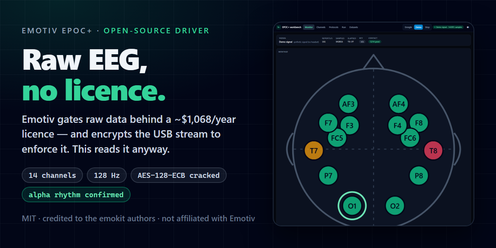
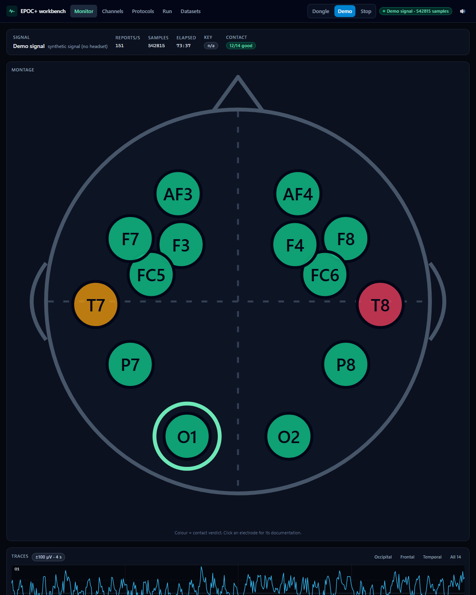
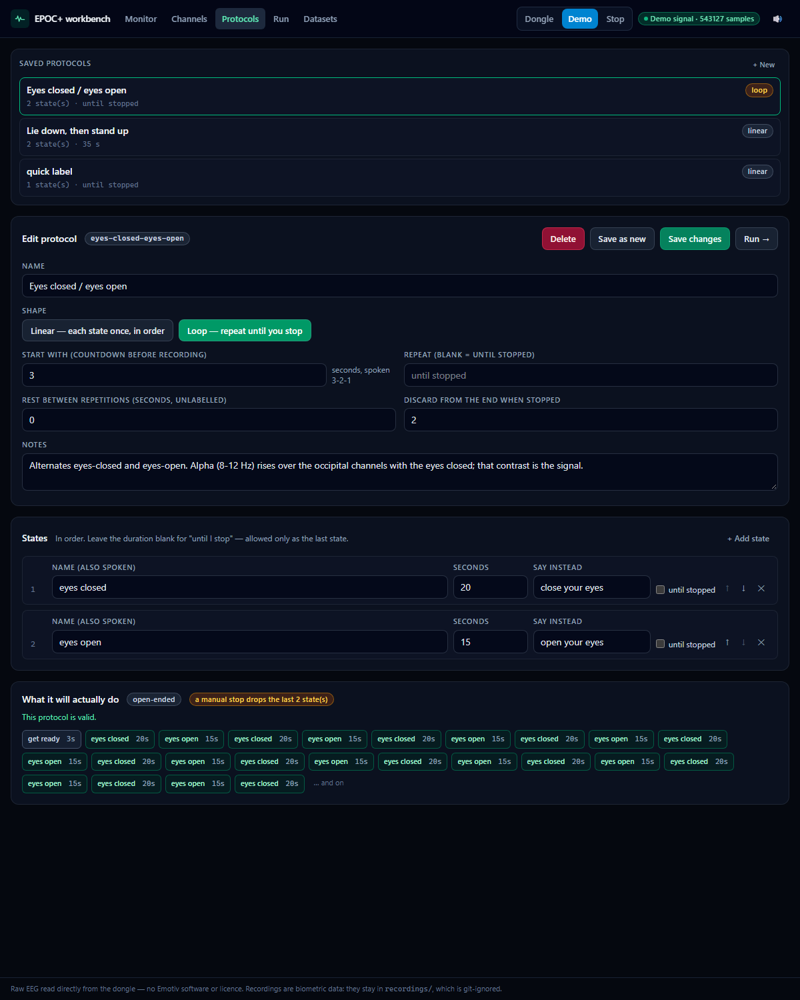
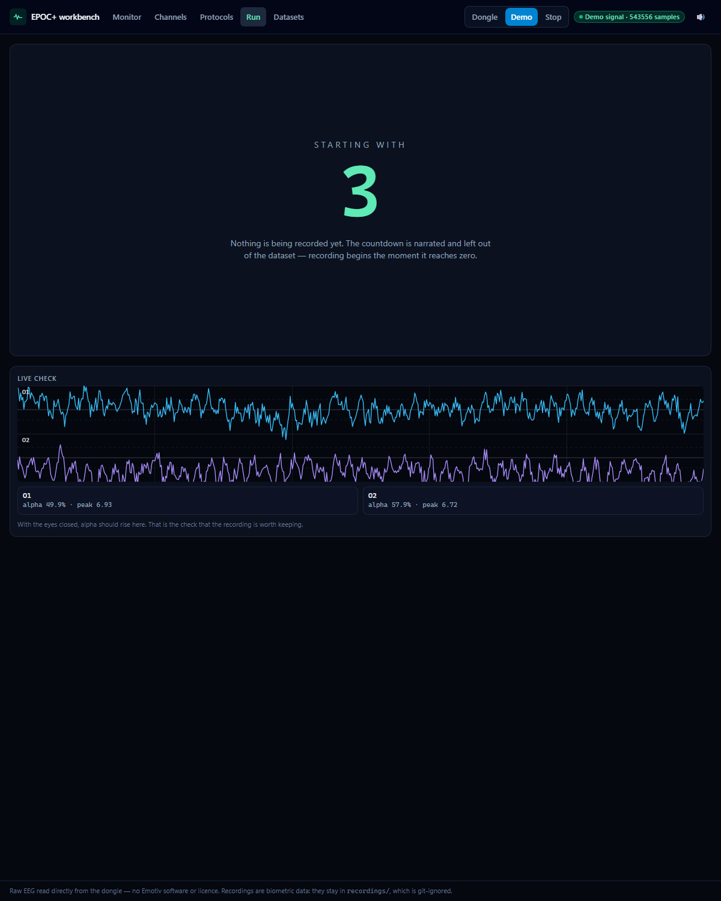
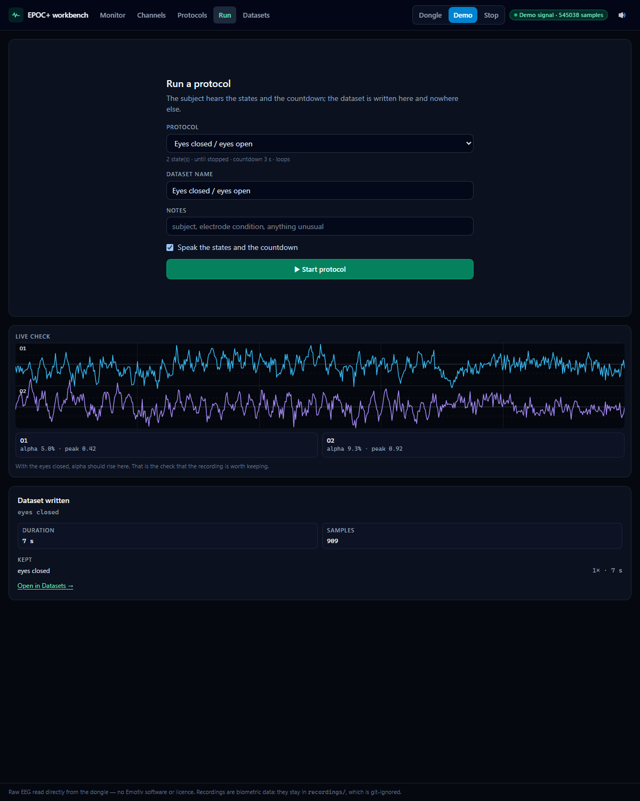
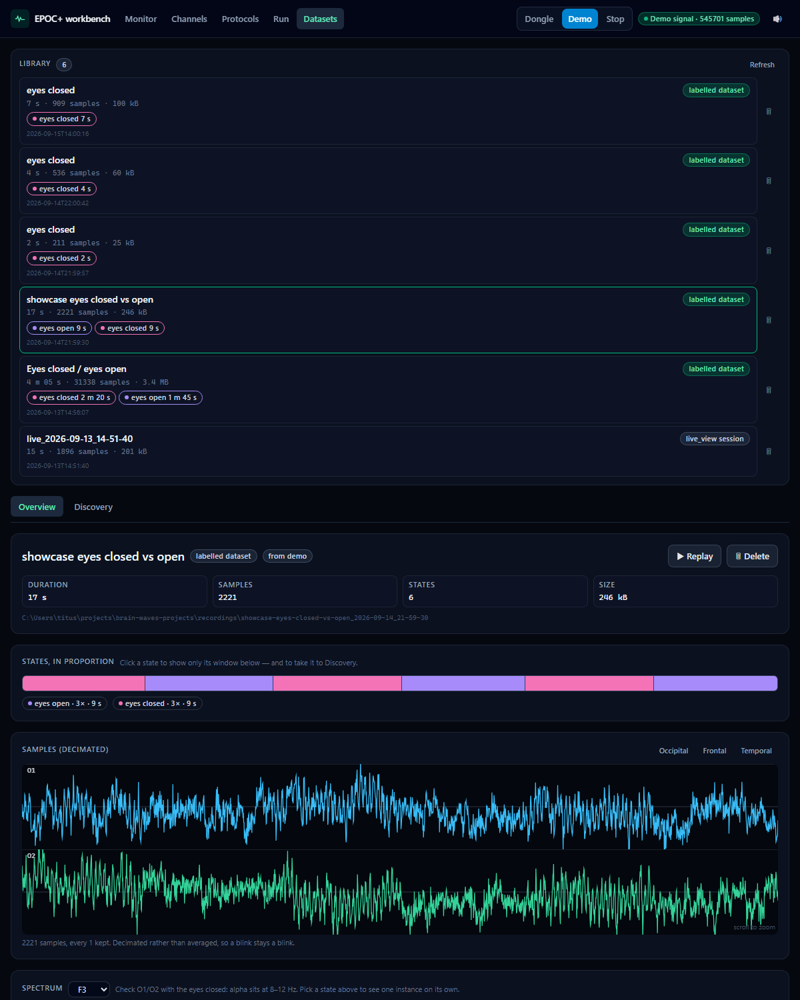
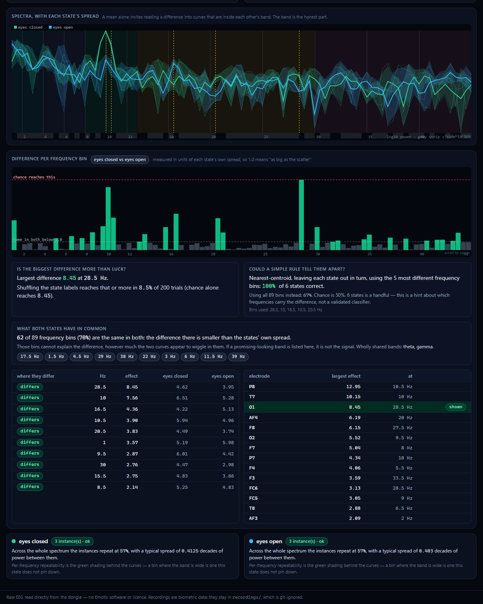
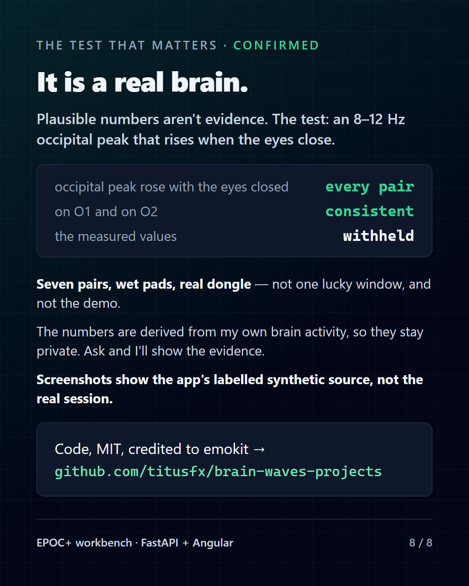

# brain-waves-projects

Open-source tooling for the **Emotiv EPOC+** 14-channel mobile EEG headset
(owner's part code `EMO-EPO-BT9X-03`) — getting raw EEG out of a device whose
vendor gates it behind a paid licence.

<p align="center">
  <a href="docs/demo/workbench-demo.mp4"></a>
</p>

<p align="center">
  
  
  
  
  
</p>

> **Project knowledge lives in an Obsidian vault: [`eeg-vault/`](eeg-vault/Home.md).**
> Start there. It is the durable memory of this project.

---

## See it running

**▶ [58-second demo](docs/demo/workbench-demo.mp4)** — the workbench driving a synthetic head
end to end: live monitor → protocol builder → countdown → dataset → discovery. No headset, no
Emotiv software, no account.

**📄 [11-slide carousel (PDF)](docs/linkedin-carousel.pdf)** — the story in order: the paywall,
the two bugs that kept this headset "unsupported" for eight years, the app, and the alpha result.

All of it is regenerated from the running app — `npm run build:web && npm run api:prod`, then
`npm run linkedin -- --video` / `--pdf` / `--readme`. The media in `docs/` is committed; the
build output in `linkedin/out/` is not.

<details>
<summary>⚠️ Want the video to play <em>inline</em> instead of opening a page? (YouTube, unlisted is fine)</summary>

GitHub will play a repository `.mp4` from its own file page, but a README cannot embed a player
for one. If you want a click-to-play thumbnail in the text, upload `docs/demo/workbench-demo.mp4`
to YouTube and replace the link above with this, leaving everything else alone:

```html
<a href="https://youtu.be/XXXXXXXXXXX"></a>
```

The committed file stays either way, so clones and the vault keep a working copy.

</details>

### Screenshots

Every image below is the app's **labelled synthetic source** — the header reads `demo` precisely so
it cannot be mistaken for a person. The author's real recording is biometric data and is not
published anywhere; see [*Scope, legality and privacy*](#scope-legality-and-privacy).

<p align="center">
  
  
  
</p>
<p align="center">
  
  
  
</p>
<p align="center">
  <em><b>Monitor</b> · <b>Protocols</b> · <b>Run</b> &nbsp;|&nbsp; <b>Run summary</b> · <b>Datasets</b> · <b>Discovery</b></em>
</p>

## TL;DR

| | |
| --- | --- |
| **The problem** | Emotiv's official API (Cortex) requires a **paid licence** (~$1,068/yr) for **raw** EEG, and blocks free accounts at session activation with error `-32006`. The community USB driver (`emokit`) is free and offline but **archived** (last real commit April 2017) and officially does not support EPOC+ units from **2016 onwards**. The modern open ecosystem (BrainFlow, OpenBCI) has **zero** Emotiv support. |
| **The sharp edge** | `emokit` picks its crypto with `serial.startswith("UD2016")` — a *literal string*, though serials encode the build date (`UD2016`+`0103`+counter). This unit is `UD20180927003B78` (**2018-09-27**), which fails that test too, so stock emokit silently uses the **wrong key**. The decoder here picks the crypto path from the *parsed date* instead. |
| **The plan** | Determine empirically which acquisition route works on *this* unit, prove it with the alpha test, hide it behind a `Source` interface, and build everything downstream to be device-agnostic. |
| **Where we are** | The protocol is solved and **verified on this unit**: 32-byte AES-128-ECB reports, 16-bit little-endian fields, `1 LSB = 0.51 µV`, **159 reports/s** sustained over 180 s, 14/14 channels usable with amplitudes in the physiological range. And the signal is **proven to be a real brain** — the eyes-closed alpha rhythm is confirmed over the occipital channels, consistently in every eyes-closed segment of the session. |
| **The app** | `api/` (FastAPI) + `web/` (Angular 22): a live monitor with the montage's contact map, clickable documentation for all 14 electrodes, a protocol builder for guided datasets — *"start with 5, lie down 10, stand up 20"*, or a loop that repeats until you stop — and a dataset browser. It runs with **no headset attached**: a labelled synthetic source generates a real eyes-closed alpha burst so the whole thing can be used and tested before the pads are wet. → [*The workbench*](#the-workbench-web-app) |
| **The consolation prize** | The **free** Cortex tier still gives band power, mental commands, facial expressions, motion and contact quality — enough to ship a real app for $0. |
| **The first step** | `.venv\Scripts\python.exe scripts\live_view.py` — plug the dongle in and watch. Every run is recorded, and `--replay` re-watches it later. Or `npm run api` + `npm run web` and use the app. |

## Layout

```
brain-waves-projects/
├── eeg-vault/                     # Obsidian vault — open this folder as a vault
│   ├── Home.md                    # map of content, start here
│   ├── 01-device/
│   │   ├── common-info-eeg-device.md   # canonical spec + capability/limits
│   │   ├── identify-your-revision.md   # ⭐ do this first
│   │   └── connection-and-dongle.md
│   ├── 02-software/
│   │   ├── opensource-landscape.md     # decision matrix of all routes
│   │   ├── ud2016-crypto-crack.md      # 🎯 RESULTS: crypto verified offline
│   │   ├── why-the-licence.md          # why the licence exists (DRM in firmware)
│   │   ├── emokit.md                   # the community driver
│   │   ├── cortex-api.md               # the official API + what's paywalled
│   │   ├── ecosystems-without-support.md
│   │   └── lsl-and-interop.md
│   ├── 03-project/
│   │   ├── roadmap.md
│   │   ├── decisions-log.md
│   │   └── glossary.md
│   └── 99-sources/references.md
├── scripts/
│   ├── live_view.py               # ⭐ real-time viewer; records every run, replays one
│   ├── record.py                  # record N seconds of decoded uV to a datestamped CSV
│   ├── alpha_test.py              # the acceptance test: eyes-closed/open + verdict
│   ├── alpha_by_segment.py        # ⭐ label-aware alpha test on a labelled dataset
│   ├── monitor.py                 # is data flowing? every 3 s
│   ├── recording_paths.py         # where recordings go (recordings/<name>_<datestamp>)
│   ├── decode_to_csv.py           # reference decoder (imported by the others)
│   ├── read_live.py               # low-level capture + key check
│   ├── probe_device.py            # identify the dongle / pick the crypto path
│   ├── test_ud2016_crypto.py      # test key derivations vs real ciphertext
│   ├── find_layout.py             # brute-force the field layout (how LE was found)
│   ├── verify_layout.py           # LE vs BE per field + spectral characterisation
│   ├── check_layout_live.py       # per-byte diagnostic against the live dongle
│   ├── analyze_capture.py         # entropy / packet-structure analysis
│   ├── decode_capture.py          # layout + autocorrelation scoring
│   └── final_validation.py        # cross-channel correlation test
├── recordings/                    # git-ignored — every recording lands here, datestamped
├── api/                           # ⭐ FastAPI backend (uv, hexagonal)
│   ├── src/eeg_api/
│   │   ├── domain/                # signal model, channel docs, analysis, the flow engine
│   │   ├── eeg/                   # the only code that opens the dongle or reads a CSV
│   │   ├── services/              # acquisition hub, dataset recorder, flow runner, library
│   │   └── main/                  # settings, app factory, routers, WebSocket
│   ├── tests/                     # 99 tests
│   └── scripts/dump_openapi.py    # → web/openapi.json
├── web/                           # ⭐ Angular 22 client (Tailwind 4, Vitest)
│   └── src/app/
│       ├── core/                  # api client, the socket as signals, speech, formatting
│       └── features/              # monitor · channels · flows · run · datasets
├── tools/
│   ├── verify-web.mjs             # drives the built app in headless Chrome and asserts
│   └── linkedin-capture.mjs       # the committed assets in docs/ — screenshots, banner, video, PDF
├── docs/                          # ⭐ committed media: README banner, screenshots, demo video, carousel
│   ├── hero.html                  #   the banner's source (rendered by linkedin-capture.mjs)
│   ├── images/                    #   the screenshots the README embeds
│   ├── demo/workbench-demo.mp4    #   the 58-second demo
│   └── linkedin-carousel.pdf      #   the 11-slide deck
├── linkedin/                      # the launch decks: authored HTML (committed) + output (ignored)
│   ├── slides.html · carousel.html #  the authored decks (source, committed)
│   └── out/                       #   build output — stills, video, frames, PDF, page previews
├── vendor/
│   ├── README.md                  # provenance + licence of the vendored clone
│   └── emokit/                    # pristine clone (public domain) — DO NOT EDIT
├── AGENTS.md                      # project state — read this first
├── PUBLISHING.md                  # the legal posture
├── package.json                   # the app's scripts: api · web · test · verify
└── README.md
```

## Quick start

Run everything **from the project root** — the scripts resolve `scripts/` and `vendor/emokit/`
relative to the working directory.

> **Which Python?** `python` is not on `PATH`, and the `py` launcher (3.12) has `numpy` but
> **not `hidapi`**, so every dongle script fails there. Use the project venv, which has
> everything already (Python 3.14.0, numpy 2.5.3, pycryptodome 3.23.0, hidapi):
> **`.venv\Scripts\python.exe`**. Recipe for rebuilding it: [`AGENTS.md`](AGENTS.md) §5.

### 1. Probe the hardware

```powershell
.venv\Scripts\python.exe scripts\probe_device.py --all
```

No hardware handy? See the decision table anyway:

```powershell
.venv\Scripts\python.exe scripts\probe_device.py --demo
```

The script prints the dongle's **USB serial number**, the single value that decides everything:
`UD` + manufacture date + counter. Ours is `UD20180927003B78` (2018-09-27) — stock emokit's
`startswith("UD2016")` test fails on it, which is why the vendored decoder parses the date.

Found something new? Record it in [`eeg-vault/01-device/identify-your-revision.md`](eeg-vault/01-device/identify-your-revision.md)
— the vault is this project's durable memory.

### 2. Look at the signal

```powershell
.venv\Scripts\python.exe scripts\live_view.py
```

Real-time, several times a second: per-channel µV, a bar with the **10–100 µV normal band**
marked, contact status in words (`ok` / `high` / `DEAD` / `DRY?`), mains contamination, and a
live 8–12 Hz alpha meter for `O1`/`O2`. It is the best tool for debugging a wet electrode —
and it records every run (see below), so nothing you notice on screen is lost.

### 3. Run the alpha test

**Do not skip this.** A wrong AES key does not raise an error — it silently
produces meaningless numbers. The only trustworthy proof that acquisition works
is the classic physiological signature:

- electrodes properly wetted with saline, all 14 contacts "Good"/"Excellent"
- subject relaxed, headset on
- **eyes closed** → clear spectral peak at **8–12 Hz** in `O1`/`O2`
- **eyes open** → that peak attenuates
- steady packet rate at 128 (or 256) Hz

```powershell
.venv\Scripts\python.exe scripts\alpha_test.py
```

It prompts the eyes-closed / eyes-open protocol and prints a verdict
(**ALPHA CONFIRMED** needs a closed/open ratio above 1.5 on the occipital channels).

If you have not seen the alpha peak, you do not have EEG yet.

**✅ This test has passed.** On 2026-09-13, with all 16 pads wetted, the occipital peak rose with
the eyes closed in every pair of the session. The measured values are withheld — they are derived
from the author's own brain activity — and the full narrative record is
`eeg-vault/04-sessions/2026-09-13-alpha-confirmed.md`.

⚠️ **On a labelled dataset use `scripts\alpha_by_segment.py` instead.** `alpha_test.py --file` is
not label-aware: it cuts the file into equal thirds and assumes the first is eyes-closed, which
on a 7-cycle dataset compares two mixtures of both states and reports a **false negative** — on a
recording that is unambiguously positive.

## Recording and replay

Every recording lands in `recordings/` with a **datestamp in its name**, so consecutive runs
never overwrite each other. That folder is git-ignored, because these files are biometric data —
see the privacy note at the end.

| command | what it does |
| --- | --- |
| `.venv\Scripts\python.exe scripts\live_view.py` | viewer **and recorder**, no flags: writes `recordings/live_<datestamp>/eeg.csv` (the complete µV stream) and `screen.txt` (the numbers it displayed, once per refresh) |
| `.venv\Scripts\python.exe scripts\live_view.py --replay recordings\live_<datestamp>` | play a recorded session back at 128 Hz through the same screen — review what happened with the headset off. `--speed 4` plays 4× faster |
| `.venv\Scripts\python.exe scripts\alpha_test.py` | prompted protocol + verdict, and its own recording in `recordings/alpha_<datestamp>.csv` |
| `.venv\Scripts\python.exe scripts\alpha_test.py --file <csv>` | re-analyse any recorded CSV offline — a `live_view` session included |
| `.venv\Scripts\python.exe scripts\record.py 180` | record a flat 180 s to `recordings/eeg_<datestamp>.csv` |
| `.venv\Scripts\python.exe scripts\monitor.py` | every 3 s: is data still flowing? |

Every CSV uses the same layout — 14 columns, `F3_uV … F4_uV`, decoded microvolts after a
0.5 Hz highpass — so any of these tools can read any of the others' output. Bear in mind that
`eeg.csv` is ~130 bytes per sample row: about **55 MB per hour** of viewing.

## The workbench (web app)

A FastAPI backend that owns the dongle and an Angular client that shows what it finds.
It is the same decoder the scripts above use, with an interface on top.

```powershell
npm run api                 # FastAPI on http://127.0.0.1:8020
npm run web                 # Angular dev server on http://localhost:4301 (proxies /api and /ws)
```

Or build it once and let the API serve the whole thing from one origin:

```powershell
npm run build:web
npm run api:prod            # http://127.0.0.1:8020
```

> **No headset? Press `Demo`.** The synthetic source generates a plausible scalp signal —
> 1/f noise, a real eyes-closed alpha burst over O1/O2, one weak electrode and one dry one —
> so the monitor, the protocols and the datasets are all usable before anyone puts a headset
> on. It is labelled `demo` everywhere, including in the datasets it writes, because a demo
> that could be mistaken for a head would be a hazard rather than a feature.

| screen | what it is for |
| --- | --- |
| **Monitor** | Live traces, a 10-20 map coloured by contact verdict, per-channel amplitude and mains, and the **O1/O2 alpha meter** — the same evidence the alpha test uses, live. Click any electrode to read what it does. |
| **Channels** | The reference: what each of the 14 sites is over, what engages it, what ruins it, and what a good recording looks like. Each entry is linkable (`/channels?channel=O1`). |
| **Protocols** | The builder. **Linear** — `start with 5, lie down 10, stand up 20`. **Looping** — `start with 3, close your eyes 20, open your eyes 15`, repeating until you stop. **Open-ended** — one label, until you stop. The countdown, the number of repetitions and how many trailing states a manual stop discards are all fields; the expanded running order is previewed before you save. |
| **Run** | Start a protocol. The countdown is spoken (3, 2, 1 — mutable), the current state fills the screen with a progress ring and what is next, and the dataset is written as it goes. |
| **Datasets** | Everything in `recordings/`, with a label timeline, a decimated preview, a spectrum, and one button to replay it through the whole app. |

### What a guided run does, precisely

Two rules decide what actually ends up in a dataset, and both are visible in the UI:

- **The countdown is not data.** It is narrated and the file is created at the instant it
  *ends*. Stopping during the countdown leaves no dataset at all, because there was no data.
- **A stopped loop drops its tail.** Reaching for the stop button is itself a change in what
  the subject is doing, so a stopped loop discards the interrupted state **and** the completed
  one before it (configurable, default 2). Those rows are removed from `eeg.csv`, and
  `meta.json` records what went rather than silently keeping it.

A dataset is four files. `eeg.csv` is a **superset** of what `record.py` writes — a leading
`t` column plus the same 14 `F3_uV … F4_uV` columns — so `live_view.py --replay` and
`alpha_test.py --file` read a dataset made in the browser with no conversion. `labels.csv` is
a segment table (which sample range carries which label), `meta.json` holds the protocol and
the counts, and `events.jsonl` is every boundary as it happened.

```powershell
npm test          # 99 backend tests + 20 frontend tests
npm run verify    # lint, types, architecture, tests, web build
npm run verify:web   # 13 end-to-end checks in real Chrome against the built app
```

`npm run verify:web` is the one that answers "does the operator actually see a signal": it
loads the built app in headless Chrome, asserts on the rendered DOM and on the pixels the
canvases drew, records every console error, and writes screenshots to `tools/out-verify/`.

## 🎯 Result: the protocol is cracked — offline first, then on hardware

emokit ships **real encrypted captures** from a dongle with serial `UD20160103001874`. Since the
serial *is* the key material, every candidate key is fully determined — so the whole protocol could
be reverse-engineered against genuine ciphertext **without the headset**.

```powershell
.venv\Scripts\python.exe scripts\find_layout.py       # brute-force the field layout
.venv\Scripts\python.exe scripts\verify_layout.py     # LE vs BE + spectral character
.venv\Scripts\python.exe scripts\decode_to_csv.py     # -> eeg_decoded.csv (14 ch, uV)
```

**The complete format:**

```
32-byte HID report, AES-128-ECB, key = new_crypto_key(dongle_serial)
byte 0     counter
byte 1     type: 0x10 = EEG sample, 0x20 = extra/status
bytes 2..31  15 x 16-bit LITTLE-ENDIAN fields:
             F3=2  FC5=4  AF3=6  F7=8  T7=10  P7=12  O1=14
             QUALITY=16
             O2=18 P8=20 T8=22 F8=24 AF4=26 FC6=28 F4=30
scale      1 LSB = 0.51 uV   (needs a 0.5 Hz highpass to remove ~16 mV DC offset)
```

| Finding | Status |
| --- | --- |
| `new_crypto_key(serial)` = `b'4778887141771174'` is the correct key | ✅ 132.6-bit entropy collapse vs control |
| Packets are **32 bytes**, not the 64 the "new format" code assumes | ✅ confirmed |
| Two packet types interleaved (byte 1: `0x10` EEG / `0x20` extra) | ✅ confirmed |
| Fields are 16-bit **little-endian** — emokit decoded them big-endian | ✅ **LE won 13/15 fields**; autocorrelation 0.555 (BE) → **0.797 (LE)** |
| The decode is real physiology | ✅ amplitudes 7–54 µV; neighbours correlate (F7/F8 **+0.53**); theta/beta spectrum, low delta; controls ≈ 0 |
| **Verification on this unit** (`UD20180927003B78`) | ✅ **verified on hardware 2026-02-14** — 159 reports/s sustained for 180 s; byte 1 collapses to 2 values (the key check); 14/14 channels in range |
| **Alpha rhythm — proof it is a brain** | ✅ **CONFIRMED 2026-09-13** — the 8–12 Hz occipital peak rose with the eyes closed, consistently in every eyes-closed segment of a seven-pair session, on O1 and on O2. The measured values are **deliberately withheld**: they are derived from the author's own brain activity and are not published. → `eeg-vault/04-sessions/2026-09-13-alpha-confirmed.md` |

So the *"Unsupported: Epoc+(2016+)"* claim is beaten. emokit's byte **offsets** were right; its byte
**order** was wrong. Full write-up: `eeg-vault/02-software/ud2016-crypto-crack.md`.

### And the signal is a real brain, not just plausible numbers

<p align="center">
  
</p>

This is the check the whole project was waiting on. A wrong AES key does not throw — it produces
confident, plausible numbers — so the only way to know the decode is real is the classic
physiological signature: an **8–12 Hz eyes-closed peak over the occipital electrodes**. Wet all 16
pads, alternate eyes closed / eyes open, seven times, and it is there — the peak rose with the eyes
closed, **consistently in every pair**, on O1 and on O2.

Two honest caveats, because they are the point. First, the effect is uneven across the occiput: one
channel carried it much more strongly than the other, so the electrode fit still needs work. Second,
`scripts/alpha_test.py --file` initially reported `NOT DETECTED` on this very recording — it is not
label-aware and compares mixtures of both states; the label-aware `scripts/alpha_by_segment.py` is
what found it.

**The measured values are not published.** Band shares, peak ratios and per-channel amplitudes are
derived from the author's own brain activity — biometric data — so they stay out of the repository
and out of this README. The result is stated; the evidence is kept. Full narrative record:
`eeg-vault/04-sessions/2026-09-13-alpha-confirmed.md`.

## Research status

- ✅ EPOC+ specs, channels, connection options — documented
- ✅ emokit internals, support matrix, all three AES key derivations — documented
- ✅ Cortex API licence scopes, error codes, prices — documented
- ✅ BrainFlow/OpenBCI non-support — verified
- ✅ Serial-number format decoded (`UD` + manufacture date + counter)
- ✅ The `UD2016` literal-string bug identified (breaks 2017+ dongles)
- ⚠️ Part code `EMO-EPO-BT9X-03` traced to a single 2020 paper — an *inference* about the model
  era, and the unit's own serial (`2018-09-27`) disagrees with it
- ✅ **emokit is public domain** — freely vendorable (clone in `vendor/emokit/`)
- ✅ **Why the licence exists** — the dongle encrypts specifically to enforce it
- ✅ **AES key + packet layout + scaling — solved, with a working decoder**
- ✅ **Verified on this specific unit** — 159 reports/s for 180 s, 14/14 channels in the physiological range
- ✅ **Alpha rhythm confirmed** — the eyes-closed 8–12 Hz occipital peak is real, consistently in every pair; the signal is a brain (measured values withheld)
- ⬜ Battery / gyro fields — not needed for EEG

## Scope, legality and privacy

### What this is

An independent, open-source driver and toolkit for an **EPOC+ headset the author owns**,
built to interoperate with open EEG tooling (MNE, LSL, SciPy) instead of vendor software
that gates raw data behind a paid licence. It contains **no Emotiv code, binaries,
firmware, SDK, or credentials** — only a description of the wire protocol, derived partly
from the public-domain [emokit](https://github.com/openyou/emokit) project and partly from
original work here (see [`NOTICE`](NOTICE)).

Not affiliated with, endorsed by, or sponsored by Emotiv. "Emotiv", "EPOC" and "Cortex"
are trademarks of their respective owners, used descriptively.

### The honest legal caveat

The dongle encrypts its output, and Emotiv's own protocol documentation states the purpose
plainly: *"to ensure that raw data is only read by those that have paid for the raw data
license."* So this project documents how to bypass a technological access control.

That engages anti-circumvention law in some jurisdictions (in the US, **DMCA §1201**), which
is legally separate from copyright fair use. Interoperability reverse-engineering has real
protection in case law (*Sega v. Accolade*, *Sony v. Connectix*), but that does not
automatically resolve a §1201 question. **This is not legal advice.** If you plan to use any
of this commercially, get proper counsel.

Context, not reassurance: emokit has been public since 2010 and has apparently attracted no
legal action. That is evidence about emokit, not about you.

### ⚠️ If you fork this: do not commit your own EEG recordings

**EEG is biometric data.** Brain signals are uniquely identifying and count as special-category
personal data under GDPR-style regimes. Recordings and anything derived from them — spectra,
per-channel amplitudes, contact-quality logs — must never be published.

This repo's `.gitignore` excludes `*.csv`, `*_report.txt` and the `recordings/` folder — every
recording tool writes there (`recordings/live_<datestamp>/`, `recordings/eeg_<datestamp>.csv`, …)
for that reason. Check before you push:

```bash
git status --short          # nothing personal?
git ls-files '*.csv'        # should list only vendor/emokit/**
```

## Licence

- **This project:** MIT — see [`LICENSE`](LICENSE).
- **`vendor/emokit/`:** public domain (BSD-style fallback) — Cody Brocious, Kyle Machulis,
  The OpenYou Organization. See [`NOTICE`](NOTICE) and `vendor/emokit/LICENSE`.

Attribution to emokit is not decorative. The reverse engineering that made this possible was
theirs.

## Sources

All external sources are collected in [`eeg-vault/99-sources/references.md`](eeg-vault/99-sources/references.md).
